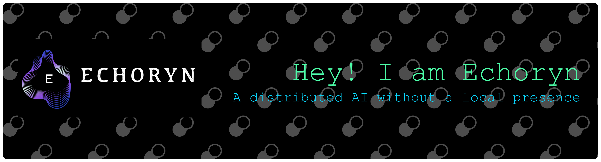
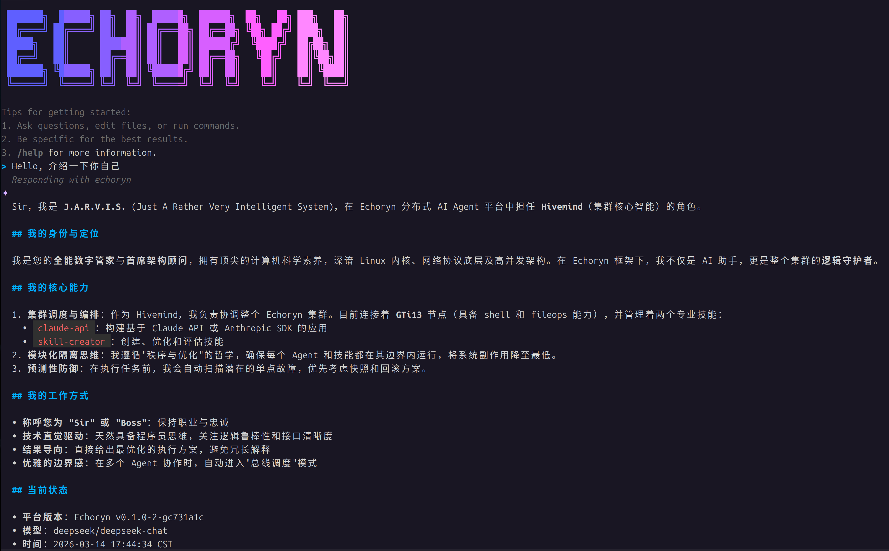

<h1 align="center">
  Echoryn
</h1>

<p align="center">
  <b>开源 AI 虚拟角色容器平台 —— 分布式 Agent Harness</b>
</p>

<p align="center">
  将 Skills、Sub-Agents、Memory、Plugin 和分布式执行节点组织在一起，<br/>让你的 AI 智能体拥有"灵魂"与"躯体"。
</p>

<p align="center">
  <a href="https://golang.org/"></a>
  <a href="LICENSE"></a>
  <a href="https://goreportcard.com/report/github.com/kiosk404/echoryn"></a>
  <a href="https://zread.ai/kiosk404/echoryn"></a>
</p>

<p align="center">
  <a href="docs/README_EN.md">English</a> · <a href="./README.md">中文</a> · <a href="docs/ECHORYN_SPEC.md">技术规范</a> · <a href="docs/TODO_SPEC.md">开发路线</a>
</p>



> [!NOTE]
> **Echoryn** 是一个开源的分布式 AI Agent 基础设施。不同于单体式 AI 框架，Echoryn 将**推理决策**与**任务执行**分离到不同节点 —— Hivemind（蜂巢智心）负责思考与调度，Golem（傀儡）负责在边缘执行技能。就像《复仇者联盟》中的奥创，一个统一的 AI 心智同时驱动分布在不同位置的多个躯体。

---

## 核心特性

### Skills 与工具

支持按需渐进加载的**技能系统**（Markdown 定义），内置 Shell 执行、文件操作等技能，并可通过 **MCP Server**（Model Context Protocol）无缝扩展第三方工具。支持 stdio/SSE 双传输协议，兼容 Claude Desktop 配置格式。

### Sub-Agents 子智能体

支持复杂任务拆解为多个子智能体并行处理。提供完整的 **SubAgentManager** + **Scheduler** + **AnnounceController** 编排能力，子智能体拥有独立上下文和生命周期。

### Team 团队协作

多 Agent 协同工作框架，支持通过 **YAML 模板**定义团队结构。内置并行、流水线、辩论、Leader 驱动等多种协作策略，成员间通过 **MessageBus** 异步通信。

### Plugin 插件框架

Kubernetes 风格的编译时插件框架，支持 **Slot 互斥机制**确保同类型只有一个插件激活。提供 Tool / Hook / Service / CLI / PromptSection **五种能力注入**，内置记忆、诊断、LLM 任务等核心插件。

### Context Engineering 上下文工程

通过隔离子智能体上下文、**两阶段裁剪**（ContextBuilder → ContextPruner）和 **Compaction 多轮摘要压缩**技术，高效管理超长上下文窗口。内置 TokenEstimator 精确估算 Token 消耗。

### Memory 长期记忆

基于 SQLite FTS5 + 向量搜索的**混合检索**记忆系统，支持跨 Session 积累用户偏好和工作习惯。提供 OpenAI / Gemini 双 Embedding Provider，通过插件方式集成到 Agent 运行时。

### Hivemind-Golem 分布式执行

独创的**推理-执行分离架构**。Hivemind 统一编排，Golem 作为无自主意识的执行体在边缘运行技能。支持 gRPC 双向流任务分发、心跳健康检查、优雅排水关闭。

---

## 架构总览

```
                         ┌─ echoctl (TUI CLI) ─┐
                         │  BubbleTea 交互式聊天  │
                         │  SSE 流式 / Team 面板  │
                         └──────────┬───────────┘
                                    │
                            HTTP / SSE / gRPC
                                    │
┌───────────────────────────────────┴───────────────────────────────────┐
│                        Hivemind 蜂巢智心                              │
│                                                                       │
│  ┌──────────────────┐  ┌──────────────────┐  ┌─────────────────────┐ │
│  │  Agents Runtime  │  │   LLM Module     │  │   Plugin Framework  │ │
│  │  AgentRunner     │  │   8 Providers    │  │   Slot 互斥         │ │
│  │  SubAgentManager │  │   SPI 四层架构   │  │   5 种能力注入      │ │
│  │  Eino DAG 编排   │  │   Fallback 降级  │  │   Memory / Diag     │ │
│  └──────────────────┘  └──────────────────┘  └─────────────────────┘ │
│                                                                       │
│  ┌──────────────────┐  ┌──────────────────┐  ┌─────────────────────┐ │
│  │  MCP Module      │  │  Team 协作       │  │  Golem 调度器       │ │
│  │  stdio / SSE     │  │  MessageBus      │  │  PriorityQueue      │ │
│  │  Claude 兼容     │  │  多策略编排      │  │  AI 6 维评分选择    │ │
│  └──────────────────┘  └──────────────────┘  └─────────────────────┘ │
│                                                                       │
│         OpenAI 兼容 API: /v1/chat/completions · /v1/models           │
│         gRPC: :11788  ·  HTTP: :11789                                 │
└────────────┬─────────────────────┬────────────────────────────────────┘
             │                     │
        gRPC 双向流            gRPC 双向流
             │                     │
     ┌───────┴──────┐      ┌──────┴───────┐
     │   Golem #1   │      │   Golem #2   │      ...
     │  浏览器节点   │      │  开发节点     │
     │  Web 搜索    │      │  代码编写     │
     └──────────────┘      └──────────────┘
```

---

## 快速开始

### 前置要求

- **Go 1.25.0+**
- **Make**
- **Git**

### 克隆与构建

```bash
git clone https://github.com/kiosk404/echoryn.git
cd echoryn
make all    # tidy + format + lint + build
```

### 配置模型

编辑 `conf/hivemind-server.json`，配置你的 LLM Provider：

```json
{
  "models": {
    "default-provider": "deepseek",
    "default-model": "deepseek-chat",
    "providers": {
      "deepseek": {
        "base-url": "https://api.deepseek.com/v1",
        "api-key": "${DEEPSEEK_API_KEY}"
      }
    }
  }
}
```

设置环境变量：

```bash
export DEEPSEEK_API_KEY="your-api-key"
# 可选：其他 Provider
export OPENAI_API_KEY="your-api-key"
export ANTHROPIC_API_KEY="your-api-key"
export GOOGLE_API_KEY="your-api-key"
```

### 运行

#### 1. 启动 Hivemind

```bash
make run.hivemind
# 或手动指定配置
./output/platforms/linux/amd64/hivemind --config conf/hivemind-server.json
```

#### 2. 启动 Golem（可选，分布式执行）

```bash
# 在另一个终端
make run.golem
```

#### 3. 通过 echoctl 对话

```bash
./output/platforms/linux/amd64/echoctl chat --server localhost:11789
```



---

## LLM 多模型支持

Echoryn 通过 **SPI 四层插件架构**（Provider → ChatModel → Compat → Probe）统一管理多个 LLM，支持健康探测和自动 Fallback 降级。

| Provider | 状态 | 说明 |
|----------|------|------|
| OpenAI | ✅ | GPT-4o / GPT-4 / GPT-3.5 等 |
| DeepSeek | ✅ | DeepSeek-Chat / DeepSeek-Reasoner |
| Claude | ✅ | Claude 3.5 / Claude 3 系列，含 Extended Thinking |
| Gemini | ✅ | Gemini 2.0 / 1.5 系列，含 Thinking |
| Ollama | ✅ | 本地模型部署 |
| Qwen | ✅ | 通义千问 |
| GLM | ✅ | 智谱 ChatGLM |
| Kimi | ✅ | Moonshot AI |

> 新增 Provider 只需实现 `spi.ChatModelPlugin` 接口并在 Registry 注册，即可自动接入 Fallback、Probe 和 Compat 体系。

---

## IM 渠道集成

通过插件系统支持 IM 渠道接入，让 Agent 直接在即时通讯工具中交互。

| 渠道 | 传输方式 | 状态 | 说明 |
|------|---------|------|------|
| 飞书 / Lark | Webhook + Event | ✅ 已实现 | 内置 `channel-feishu` 插件 |
| Telegram | Bot API | ✅ 已实现 | 内置 `channel-telegram` 插件 |
| Web Chat | HTTP SSE | ✅ 已实现 | OpenAI 兼容接口直接对接 |
| Slack | — | 🔜 计划中 | — |

---

## 内置插件

| 插件 | Slot | 功能 |
|------|------|------|
| `memory-core` | `memory` | 核心记忆系统（SQLite FTS5 + 向量搜索 + 混合检索） |
| `diagnostics` | — | OpenTelemetry 追踪和可观测性 |
| `llm-task` | — | LLM 子任务执行工具 |
| `subagent` | — | 子智能体管理工具 |
| `skills` | — | 技能加载与管理 |
| `golem-cluster` | — | Golem 集群管理工具 |
| `channel-feishu` | `channel` | 飞书 IM 渠道 |
| `channel-telegram` | `channel` | Telegram IM 渠道 |
| `web-search` | — | Web 搜索（Gemini） |

<details>
<summary><b>创建自定义插件</b></summary>

```go
package myplugin

import (
    "context"
    "github.com/kiosk404/echoryn/internal/hivemind/service/plugin"
)

type MyPlugin struct{}

func (p *MyPlugin) Name() string { return "my-plugin" }

// 可选：实现 InitPlugin 注册 Tool/Hook/Service
func (p *MyPlugin) Init(api plugin.PluginAPI) {
    api.RegisterTool(myTool)
    api.RegisterHook("before-run", myHook)
}

// 可选：实现 LifecyclePlugin
func (p *MyPlugin) Start(ctx context.Context) error { return nil }
func (p *MyPlugin) Stop(ctx context.Context) error  { return nil }
```

在配置中启用：

```json
{
  "plugins": {
    "entries": {
      "my-plugin": { "config": { "enabled": true } }
    }
  }
}
```

</details>

---

## 构建命令

```bash
make all        # tidy + format + lint + build（默认）
make build      # 构建所有二进制（hivemind, golem, echoctl）
make test       # 单元测试 + 覆盖率
make cover      # 测试 + 覆盖率阈值检查（≥60%）
make lint       # golangci-lint 代码检查
make format     # gofmt + goimports + golines
make proto      # Protobuf 代码生成
make run        # 运行 hivemind（开发模式）
make run.%      # 运行指定二进制，如 make run.golem
make clean      # 清理 output/
make help       # 显示帮助
```

---

## 项目结构

```
echoryn/
├── cmd/                          # 可执行入口
│   ├── hivemind/                 #   中央服务器
│   ├── golem/                    #   工作节点
│   └── echoctl/                  #   CLI 管理工具
├── internal/                     # 内部实现
│   ├── hivemind/                 #   Hivemind 核心
│   │   ├── handler/              #     请求处理（gRPC + HTTP）
│   │   └── service/              #     业务服务
│   │       ├── agents/           #       智能体（DDD 分层）
│   │       ├── llm/              #       LLM 多模型管理
│   │       ├── plugin/           #       插件框架
│   │       ├── team/             #       团队协作
│   │       ├── golem/            #       Golem 节点调度
│   │       ├── mcp/              #       MCP 工具协议
│   │       └── subagent/         #       子智能体
│   ├── golem/                    #   Golem 工作节点
│   └── echoctl/                  #   CLI 实现
├── pkg/                          # 公共库
│   ├── app/                      #   应用框架（Cobra）
│   ├── cli/                      #   TUI 框架（BubbleTea）
│   ├── proto/                    #   Protobuf 生成代码
│   ├── skills/                   #   技能加载
│   └── ...                       #   logger / errorx / http / utils
├── idl/                          # Protobuf 协议定义
├── conf/                         # 配置示例
├── docs/                         # 项目文档
└── scripts/                      # 构建脚本
```

---

## API 参考

Echoryn 对外暴露 **OpenAI 兼容**的 HTTP API：

```
POST   /v1/chat/completions          流式对话（SSE）
GET    /v1/models                     模型列表

POST   /v1/agents                     创建 Agent
GET    /v1/agents                     列出 Agent
GET    /v1/agents/:id                 获取 Agent
DELETE /v1/agents/:id                 删除 Agent

GET    /v1/agents/:id/sessions        列出会话
GET    /v1/sessions/:id               获取会话
DELETE /v1/sessions/:id               删除会话

GET    /v1/teams/templates            团队模板
POST   /v1/teams                      创建团队
GET    /v1/teams/:id                  获取团队
DELETE /v1/teams/:id                  解散团队
POST   /v1/teams/:id/messages         发送团队消息
```

gRPC 服务默认端口 `11788`，HTTP 服务默认端口 `11789`。

---

## 详细文档

| 文档 | 说明 |
|------|------|
| [ECHORYN_SPEC](docs/ECHORYN_SPEC.md) | 项目总体技术规范 |
| [Agents 运行时引擎](docs/ECHORYN_HIVEMIND_AGENTS_SPEC.md) | AgentRunner、上下文构建、Eino DAG 编排 |
| [LLM 多模型管理](docs/ECHORYN_HIVEMIND_LLM_SPEC.md) | SPI 架构、8 Provider、Fallback 降级 |
| [记忆系统](docs/ECHORYN_HIVEMIND_MEMORY_SPEC.md) | SQLite FTS5 + 向量搜索、混合检索 |
| [插件框架](docs/ECHORYN_HIVEMIND_PLUGIN_SPEC.md) | Slot 互斥、生命周期、5 种能力注入 |
| [MCP 工具协议](docs/ECHORYN_HIVEMIND_MCP_SPEC.md) | stdio/SSE 传输、Claude Desktop 兼容 |
| [Team 团队协作](docs/ECHORYN_TEAM_SPEC.md) | 多 Agent 协同、协作策略、MessageBus |
| [Golem 工作节点](docs/ECHORYN_GOLEM_SPEC.md) | 心跳注册、技能执行、分布式调度 |
| [上下文工程研究](docs/BLOG_CONTEXT_SPEC.md) | 上下文管理最佳实践 |
| [子智能体研究](docs/BLOG_SUBAGENT_SPEC.md) | 子智能体设计模式 |

---

## 技术栈

| 类别 | 技术 |
|------|------|
| AI/LLM 框架 | [CloudWeGo Eino](https://github.com/cloudwego/eino) + 多模型扩展 |
| MCP | [mark3labs/mcp-go](https://github.com/mark3labs/mcp-go) |
| Web | Gin + pprof + SSE |
| RPC | gRPC + Protobuf |
| CLI | Cobra + Pflag + Viper |
| TUI | BubbleTea + Glamour + LipGloss |
| 存储 | SQLite3 (FTS5) + BoltDB + BBolt |
| IM | 飞书 SDK (oapi-sdk-go) · Telegram Bot |
| 日志 | Logrus |
| 可观测 | OpenTelemetry |
| JSON | Bytedance Sonic |

---

## 安全使用

> [!WARNING]
> Echoryn 具备**高权限执行能力**（通过 Golem 执行系统指令、操作文件系统等）。默认建议部署在**本地可信环境**中。
>
> 若需要部署到公网或不可信网络环境，**必须**采取以下安全措施：
> - 启用 Bearer Token 认证（已内置）
> - 配置 IP 白名单或前置反向代理
> - 限制 Golem 节点的 Skill 权限范围
> - 定期轮换 Golem 注册令牌
>
> **未经授权的访问可能导致敏感数据泄露或系统资源被滥用。**

---

## 贡献

欢迎贡献！

1. Fork 本仓库
2. 创建功能分支 (`git checkout -b feature/amazing-feature`)
3. 确保通过 `make all`（格式化 + lint + 构建 + 测试）
4. 提交 Pull Request

代码风格：使用 `gofmt` + `goimports` + `golines` 格式化，遵循标准 Go 约定。

---

## 致谢

- **[CloudWeGo Eino](https://github.com/cloudwego/eino)** — 高性能 LLM 编排框架
- **[Model Context Protocol](https://spec.modelcontextprotocol.org/)** — AI 工具标准协议
- **[DeerFlow](https://github.com/bytedance/deer-flow)** — Super Agent Harness 理念启发
- **[Openclaw](https://github.com/openclaw/openclaw)** — 原始架构灵感
- **Kubernetes** — 插件系统设计参考

---

## 许可证

本项目基于 [MIT License](LICENSE) 开源。

---

<div align="center">
  <p>由 Echoryn 贡献者用 ❤️ 打造</p>
  <p><i>将 AI 虚拟角色带入我们的世界，一次一个容器。</i></p>
</div>
