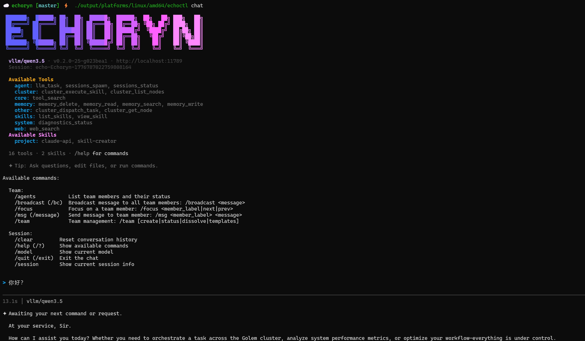

<h1 align="center">
  Echoryn
</h1>

<p align="center">
  <b>Open Source AI Virtual Character Container Platform — Distributed Agent Harness</b>
</p>

<p align="center">
  Organizes Skills, Sub-Agents, Memory, Plugins, and distributed execution nodes together,<br/>giving your AI agents "soul" and "body".
</p>


<div align="center">

[](https://golang.org/)
[](LICENSE)
[](https://goreportcard.com/report/github.com/kiosk404/echoryn)
[![zread](https://img.shields.io/badge/Ask_Zread-_.svg?style=flat&color=00b0aa&labelColor=000000&logo=data%3Aimage%2Fsvg%2Bxml%3Bbase64%2CPHN2ZyB3aWR0aD0iMTYiIGhlaWdodD0iMTYiIHZpZXdCb3g9IjAgMCAxNiAxNiIgZmlsbD0ibm9uZSIgeG1sbnM9Imh0dHA6Ly93d3cudzMub3JnLzIwMDAvc3ZnIj4KPHBhdGggZD0iTTQuOTYxNTYgMS42MDAxSDIuMjQxNTZDMS44ODgxIDEuNjAwMSAxLjYwMTU2IDEuODg2NjQgMS42MDE1NiAyLjI0MDFWNC45NjAxQzEuNjAxNTYgNS4zMTM1NiAxLjg4ODEgNS42MDAxIDIuMjQxNTYgNS42MDAxSDQuOTYxNTZDNS4zMTUwMiA1LjYwMDEgNS42MDE1NiA1LjMxMzU2IDUuNjAxNTYgNC45NjAxVjIuMjQwMUM1LjYwMTU2IDEuODg2NjQgNS4zMTUwMiAxLjYwMDEgNC45NjE1NiAxLjYwMDFaIiBmaWxsPSIjZmZmIi8%2BCjxwYXRoIGQ9Ik00Ljk2MTU2IDEwLjM5OTlIMi4yNDE1NkMxLjg4ODEgMTAuMzk5OSAxLjYwMTU2IDEwLjY4NjQgMS42MDE1NiAxMS4wMzk5VjEzLjc1OTlDMS42MDE1NiAxNC4xMTM0IDEuODg4MSAxNC4zOTk5IDIuMjQxNTYgMTQuMzk5OUg0Ljk2MTU2QzUuMzE1MDIgMTQuMzk5OSA1LjYwMTU2IDE0LjExMzQgNS42MDE1NiAxMy43NTk5VjExLjAzOTlDNS42MDE1NiAxMC42ODY0IDUuMzE1MDIgMTAuMzk5OSA0Ljk2MTU2IDEwLjM5OTlaIiBmaWxsPSIjZmZmIi8%2BCjxwYXRoIGQ9Ik0xMy43NTg0IDEuNjAwMUgxMS4wMzg0QzEwLjY4NSAxLjYwMDEgMTAuMzk4NCAxLjg4NjY0IDEwLjM5ODQgMi4yNDAxVjQuOTYwMUMxMC4zOTg0IDUuMzEzNTYgMTAuNjg1IDUuNjAwMSAxMS4wMzg0IDUuNjAwMUgxMy43NTg0QzE0LjExMTkgNS42MDAxIDE0LjM5ODQgNS4zMTM1NiAxNC4zOTg0IDQuOTYwMVYyLjI0MDFDMTQuMzk4NCAxLjg4NjY0IDE0LjExMTkgMS42MDAxIDEzLjc1ODQgMS42MDAxWiIgZmlsbD0iI2ZmZiIvPgo8cGF0aCBkPSJNNCAxMkwxMiA0TDQgMTJaIiBmaWxsPSIjZmZmIi8%2BCjxwYXRoIGQ9Ik00IDEyTDEyIDQiIHN0cm9rZT0iI2ZmZiIgc3Ryb2tlLXdpZHRoPSIxLjUiIHN0cm9rZS1saW5lY2FwPSJyb3VuZCIvPgo8L3N2Zz4K&logoColor=ffffff)](https://zread.ai/kiosk404/echoryn)

</div>

## ✨ Overview

**Echoryn** is a distributed AI virtual character container platform designed to provide AI agents with a "soul container" that brings them into our world. Inspired by the Openclaw project and Ultron from *The Avengers*, Echoryn adopts a central intelligence (Hivemind) with replaceable machine bodies (Golem) architecture, similar to Kubernetes coordination patterns.

Like Ultron can switch between different mechanical bodies to execute tasks, Echoryn's Hivemind (collective intelligence) acts as the central agent, coordinating multiple Golem (worker) nodes to achieve distributed task execution for AI agents. Hivemind handles decision-making, memory, and scheduling, while Golem serves as interchangeable "bodies" performing concrete operations.

The platform provides a complete infrastructure for AI agents, including LLM integration, plugin systems, memory management, and distributed task execution.

## Language Versions
- [English Version](docs/README_EN.md) - English documentation (main)
- [中文版本](./README.md) - Chinese documentation

## Core Features

### Skills & Tools

Supports an on-demand progressive loading **skill system** (Markdown-defined), with built-in skills for Shell execution, file operations, etc., and seamless third-party tool extension via **MCP Server** (Model Context Protocol). Supports stdio/SSE dual transport protocols, compatible with Claude Desktop configuration format.

### Sub-Agents

Supports decomposing complex tasks into multiple sub-agents for parallel processing. Provides complete **SubAgentManager** + **Scheduler** + **AnnounceController** orchestration capabilities. Sub-agents have independent contexts and lifecycles.

### Team Collaboration

Multi-Agent collaborative work framework, supports defining team structures via **YAML templates**. Built-in parallel, pipeline, debate, Leader-driven collaboration strategies. Members communicate asynchronously via **MessageBus**. Supports **SSE real-time event streaming**, both TUI and GUI can subscribe to team dynamics.

### Plugin Framework

Kubernetes-style compile-time plugin framework with **Slot mutual exclusion mechanism** ensuring only one plugin of a specific type is active. Provides Tool / Hook / Service / CLI / PromptSection **five capability injections**. Built-in core plugins for memory, diagnostics, LLM tasks, etc.

### Context Engineering

Efficiently manages ultra-long context windows through isolated sub-agent contexts, **two-stage pruning** (ContextBuilder → ContextPruner), and **Compaction multi-round summary compression**. Built-in TokenEstimator for accurate token consumption estimation.

### Memory & Long-term Memory

Hybrid retrieval memory system based on SQLite FTS5 + vector search, supporting cross-session accumulation of user preferences and work habits. Provides OpenAI / Gemini dual Embedding Providers, integrated into Agent runtime via plugins.

---

## Architecture Overview

```
                         ┌─ echoctl (TUI CLI) ─┐
                         │  BubbleTea Interactive Chat │
                         │  SSE Streaming / Team Panel │
                         └──────────┬───────────┘
                                    │
                            HTTP / SSE / gRPC
                                    │
┌───────────────────────────────────┴───────────────────────────────────┐
│                        Hivemind (Collective Intelligence)              │
│                                                                       │
│  ┌──────────────────┐  ┌──────────────────┐  ┌─────────────────────┐ │
│  │  Agents Runtime  │  │   LLM Module     │  │   Plugin Framework  │ │
│  │  AgentRunner     │  │   8 Providers    │  │   Slot Mutex        │ │
│  │  SubAgentManager │  │   SPI 4-Layer    │  │   5 Capability      │ │
│  │  Eino DAG Flow   │  │   Fallback       │  │   Memory / Diag     │ │
│  └──────────────────┘  └──────────────────┘  └─────────────────────┘ │
│                                                                       │
│  ┌──────────────────┐  ┌──────────────────┐  ┌─────────────────────┐ │
│  │  MCP Module      │  │  Team Collaboration│  │  Golem Scheduler   │ │
│  │  stdio / SSE     │  │  MessageBus      │  │  PriorityQueue      │ │
│  │  Claude Compatible│  │  Multi-Strategy  │  │  AI 6-D Scoring    │ │
│  └──────────────────┘  └──────────────────┘  └─────────────────────┘ │
│                                                                       │
│         OpenAI Compatible API: /v1/chat/completions · /v1/models     │
│         gRPC: :11788  ·  HTTP: :11789                                 │
└────────────┬─────────────────────┬────────────────────────────────────┘
             │                     │
        gRPC Bidirectional     gRPC Bidirectional
             │                     │
     ┌───────┴──────┐      ┌──────┴───────┐
     │   Golem #1   │      │   Golem #2   │      ...
     │  Browser Node│      │  Dev Node    │
     │  Web Search  │      │  Code Writing│
     └──────────────┘      └──────────────┘
```

## Quick Start

### Prerequisites

- **Go 1.25.0+**
- **Make**
- **Git**

### Clone & Build

```bash
git clone https://github.com/kiosk404/echoryn.git
cd echoryn
make all    # tidy + format + lint + build
```

### Configure Models

Edit `conf/hivemind-server.json` to configure your LLM Provider:

```json
{
  "models": {
    "default-provider": "deepseek",
    "default-model": "deepseek-chat",
    "providers": {
      "deepseek": {
        "base-url": "https://api.deepseek.com/v1",
        "api-key": "${DEEPSEEK_API_KEY}"
      }
    }
  }
}
```

Set environment variables:

```bash
export DEEPSEEK_API_KEY="your-api-key"
# Optional: other Providers
export OPENAI_API_KEY="your-api-key"
export ANTHROPIC_API_KEY="your-api-key"
export GOOGLE_API_KEY="your-api-key"
```

### Run

#### 1. Start Hivemind

```bash
make run.hivemind
# Or manually with configuration
./output/platforms/linux/amd64/hivemind --config conf/hivemind-server.json
```

#### 2. Start Golem (Optional, for distributed execution)

```bash
# In another terminal
make run.golem
```

#### 3. Chat via echoctl

```bash
./output/platforms/linux/amd64/echoctl chat --server localhost:11789
```



## 📦 Build Options

Echoryn uses a comprehensive Makefile for build automation:

```bash
# Build all binaries
make build

# Run Hivemind
make run

# Build specific binaries
make build BINS="hivemind echoctl"

# Generate Protobuf code
make proto

# Clean build output
make clean
```

## ⚙️ Configuration

### Hivemind Configuration (`conf/hivemind-server.json`)

```json
{
  "grpc": {
    "bind-address": "0.0.0.0",
    "bind-port": 11788,
    "max-msg-size": 4194304
  },
  "serving": {
    "mode": "debug",
    "healthz": true,
    "bind-address": "0.0.0.0",
    "bind-port": 11789
  },
  "models": {
    "mode": "merge",
    "default-provider": "deepseek",
    "default-model": "deepseek-chat",
    "providers": {
      "deepseek": {
        "base-url": "https://api.deepseek.com/v1",
        "api-key": "${DEEPSEEK_API_KEY}",
        "models": [...]
      }
    }
  },
  "plugins": {
    "enabled": true,
    "slots": {
      "memory": "memory-core"
    },
    "entries": {...}
  }
}
```

### Golem Configuration (`conf/golem-worker.json`)

```json
{
  "hivemind": {
    "address": "localhost:11788",
    "token": "${GOLEM_TOKEN}",
    "heartbeat-interval": "30s"
  },
  "skills": {
    "enabled": true,
    "workspace-dir": ".echoryn/golem"
  }
}
```

### Environment Variables

```bash
# LLM API Keys
export DEEPSEEK_API_KEY="your-api-key"
export OPENAI_API_KEY="your-api-key"
export ANTHROPIC_API_KEY="your-api-key"

# Golem Configuration
export GOLEM_TOKEN="your-golem-token"

# Logging
export LOG_LEVEL="info"
```

## 🔌 Plugin System

Echoryn features a powerful plugin system inspired by Kubernetes scheduler framework:

### Plugin Types

- **Tools**: Extend agent capabilities with new functions
- **Hooks**: Intercept and modify system behavior at key points
- **Services**: Long-running background services
- **CLI Commands**: Add new commands to echoctl
- **Prompt Sections**: Extend system prompts with dynamic content
- **Runtime APIs**: Provide APIs for agent runtime

### Creating a Plugin

1. **Implement the Plugin Interface**:
   ```go
   package myplugin

   import (
       "context"
       "github.com/kiosk404/echoryn/internal/hivemind/service/plugin"
   )

   type MyPlugin struct{}

   func (p *MyPlugin) Name() string { return "my-plugin" }
   func (p *MyPlugin) Init(ctx context.Context) error { return nil }
   func (p *MyPlugin) Start(ctx context.Context) error { return nil }
   func (p *MyPlugin) Stop(ctx context.Context) error { return nil }
   ```

2. **Register Your Plugin**:
   ```go
   func init() {
       plugin.Register(&MyPlugin{})
   }
   ```

3. **Configure in Hivemind**:
   ```json
   {
     "plugins": {
       "enabled": true,
       "entries": {
         "my-plugin": {
           "config": {
             "enabled": true,
             "my-setting": "value"
           }
         }
       }
     }
   }
   ```

See the [Plugin System Specification](docs/ECHORYN_HIVEMIND_MEMORY.md) for detailed information.

## 🛠️ Development

### Setting Up Development Environment

```bash
# Clone the repository
git clone https://github.com/kiosk404/echoryn.git
cd echoryn

# Install Go dependencies
go mod download

# Install development tools
make tools.install

# Build and run tests
make all
```

### Project Structure

- **`cmd/`**: Main application entry points
- **`internal/`**: Private application code
- **`pkg/`**: Public libraries
- **`idl/`**: Protocol definitions (gRPC)
- **`conf/`**: Configuration examples
- **`docs/`**: Documentation
- **`scripts/`**: Build and development scripts

### Code Style

- Use `gofmt`, `goimports`, and `golines` for formatting
- Follow standard Go conventions
- Write comprehensive tests
- Document public APIs

### Testing

```bash
# Run all tests
make test

# Run tests with coverage
make cover

# Run specific test
go test ./internal/hivemind/...
```

## 📚 Documentation

### Core Specifications
- [Plugin System Specification](docs/ECHORYN_HIVEMIND_MEMORY.md) - Detailed plugin architecture
- [Scheduler Specification](internal/hivemind/service/golem/scheduler/SCHED_SPEC.md) - Task scheduling engine design
- Configuration files in `conf/` - Example configurations

### Module Specifications (in `.docs/` directory)
- `ECHORYN_HIVEMIND_AGENTS.md` - Agents runtime engine
- `ECHORYN_HIVEMIND_LLM.md` - LLM multi-model management
- `ECHORYN_HIVEMIND_MEMORY.md` - Memory system
- `ECHORYN_HIVEMIND_PLUGIN.md` - Plugin framework
- `ECHORYN_HIVEMIND_MCP.md` - MCP tool calling

### Code Documentation
- Comprehensive API documentation in code comments
- GoDoc generated documentation (coming soon)

## 🤝 Contributing

Contributions are welcome! Here's how you can help:

1. **Report Issues**: Use the GitHub issue tracker to report bugs or request features
2. **Submit Pull Requests**: Fork the repository and submit PRs with improvements
3. **Improve Documentation**: Help enhance documentation and examples
4. **Share Ideas**: Discuss potential improvements in issues

### Development Workflow

1. Fork the repository
2. Create a feature branch (`git checkout -b feature/amazing-feature`)
3. Commit your changes (`git commit -m 'Add amazing feature'`)
4. Push to the branch (`git push origin feature/amazing-feature`)
5. Open a Pull Request

## 📄 License

This project is licensed under the MIT License - see the [LICENSE](LICENSE) file for details.

## 🙏 Acknowledgments

- **Openclaw**: Inspiration and architectural patterns
- **CloudWeGo Eino**: Advanced LLM framework
- **Kubernetes**: Plugin system design inspiration
- **Model Context Protocol (MCP)**: Standardized tool integration

## 🔗 Related Projects

- [Openclaw](https://github.com/openclaw/openclaw) - Original inspiration
- [CloudWeGo Eino](https://github.com/cloudwego/eino) - LLM framework
- [Model Context Protocol](https://spec.modelcontextprotocol.org/) - Standard for AI tools

---

<div align="center">
  <p>Made with ❤️ by the Echoryn contributors</p>
  <p>Bringing AI virtual characters into our world, one container at a time</p>
</div>